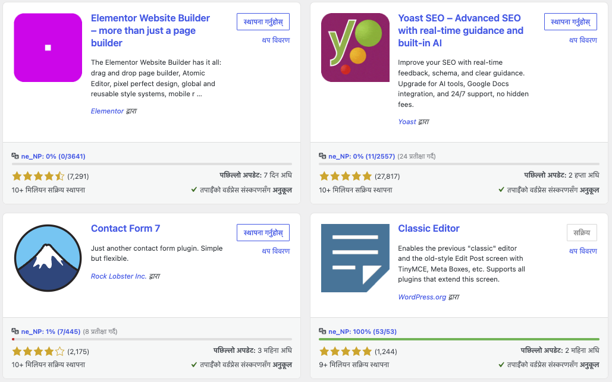

# GlotStat

Displays plugin translation stats.

## Requirements

- WordPress 6.9+
- PHP 7.4+

## Install

Download the [latest release zip](https://github.com/ernilambar/glotstat/releases/latest/download/glotstat.zip) and upload it via Plugins → Add New → Upload Plugin.

## Screenshot

## Contributing

- Run `composer format` then `composer lint` before submitting a PR; both must pass clean.
- Follow existing code style and keep changes focused.

## License

Copyright (c) 2026 Nilambar Sharma

[GPLv2 or later](https://spdx.org/licenses/GPL-2.0-or-later.html)
